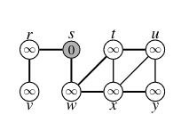

# Estruturas de representa o de grafos
##Objetivo

A teoria dos grafos ou de grafos é um ramo da matemática que estuda as relações entre os objetos de um determinado conjunto. Esse codigo tem o objetivo de comparar o uso de 3 tipos de grafos diferentes:
 - _Listas de Adjacencia_
 - _Matrizes de Adjacencia_
 - _Matrizes de Incidencia_


Estas 3 estruturas serão submetidas a dois metodos de busca diferentes:
 - _DFS (Depth-First Search)_
 - _BFS (Breadth-First Search)_

Apos isso será analisado o tempo e o gasto de memoria para cada um.

## Adaptaçoes no codigo

Todo codigo foi feito de uma adaptação da _"Lista_De_Adjacencia"_ que por sua vez foi feita inicialmente em **C** e foi convertida em **C++** para que nao ocorra diferença nos testes de tempo e gasto de memoria pela diferença de linguagem.
Adaptaçoes gerais feitas foram a passagem do tipo _List_ para _int_, o tipo _Graph_ foi transformado numa classe que tem sua inicializaçao por template, Fazendo assim o codigo criar uma matriz mais simples.


### Matriz de Adjacencia
#### DFS
```
template <int V>
void  MatrizAdj<V>::DFSVisit(int vertex,int *cor, int *d,int *f, int *tempo){
    cor[vertex]  = 1;
	*tempo += 1;
	d[vertex] = *tempo;

	for(int i = 0; i < this->NVertex; i++)
		if(Matriz[vertex][i]==1 && cor[i] == 0){
			DFSVisit(i,cor, d, f, tempo);
        }

	cor[vertex] = 2;
	*tempo += 1;
	f[vertex] = *tempo;
    cout<<"Vertex:"<<vertex<<" D:"<<d[vertex]<<" F:"<<f[vertex]<<endl;
};
```
A mudança da _Matriz de Incidencia_ principal no _DFS_ foi feita no _"DSFVisit"_. Ele ira seguir a linha V para verificar onde tem **1** verificando suas conexões.


#### BFS
```
template <int V>
void MatrizAdj<V>::BFS(int vertex ){
    int cor[this->NVertex]={{0}}; //0 Branco, 1 Cinza, 2 Preto
	int d[this->NVertex]={{-1}}; //infinito
	int pi[this->NVertex]={{-1}}; // -1 == NULL / ? não tem pai ainda
	queue<int> lista;

	cor[vertex] = 1;
	d[vertex]   = 0;
	pi[vertex]  = -1;

	lista.push(vertex);

	while (lista.size() > 0){
		int atual=lista.front();
        lista.pop();

		for(int i = 0; i < this->NVertex; i++){
			if(this->Matriz[atual][i]==1 && cor[i] == 0){
				cor[i] = 1;
				d[i]   = d[atual] + 1;
				pi[i]  = atual;
				lista.push(i);
			}
		}

		cor[atual] = 2;
		cout<<"Vertex:"<<atual<<endl;
	}
}
```

Para a Matriz de Adjacencia o BFS foi modificado para poder passar por todos vertices ligados com o vertice atual, verificando na matriz se estao conectados pela presença do **1** na casa da verificação. 


### Matriz de Insidencia

#### DFS
```
template <int V,int E>
void  MatrizInc<V,E>::DFSVisit(int vertex,int *cor, int *d,int *f, int *tempo){
    cor[vertex]  = 1;
	*tempo += 1;
	d[vertex] = *tempo;

	for(int i=0; i<this->NEdge; i++){
        if (Matriz[vertex][i]==1){
            for (int j= 0; j<NVertex; j++){
                if(Matriz[j][i]==-1 && cor[j] == 0){
			    DFSVisit(j,cor, d, f, tempo);
            }
            }
        }   
    }
	cor[vertex] = 2;
	*tempo += 1;
	f[vertex] = *tempo;
    cout<<"Vertex:"<<vertex<<" D:"<<d[vertex]<<" F:"<<f[vertex]<<endl;
};
```
A _Matriz de Incidencia_ a mudança tambem ocorre no _"DFSVisit"_ mas tem algumas diferenças por ser uma matriz VxA com uma organizaçao diferente. Nela é preciso verificar alem do **1** do vertice saida é necessario verificar o **-1** no vertice de chegada.


#### BFS
```
template <int V,int E>
void MatrizInc<V,E>::BFS(int vertex ){
 int cor[this->NVertex]={{0}}; //0 Branco, 1 Cinza, 2 Preto
	int d[this->NVertex]={{-1}}; //infinito
	int pi[this->NVertex]={{-1}}; // -1 == NULL / ? não tem pai ainda
	queue<int> lista;

	cor[vertex] = 1;
	d[vertex]   = 0;
	pi[vertex]  = -1;

	lista.push(vertex);

	while (lista.size() > 0){
		int atual=lista.front();
        lista.pop();

		for(int i = 0; i < this->NEdge; i++){
            if (Matriz[atual][i]){   
                for (int j = 0; j < NVertex; j++){
			        if(this->Matriz[j][i]==1 && cor[j] == 0){
			        	cor[j] = 1;
			        	d[j]   = d[atual] + 1;
			        	pi[j]  = atual;
			        	lista.push(j);
			        }
                }
            }     
		}
		cor[atual] = 2;
		cout<<"Vertex:"<<atual<<endl;
	}
}
```

No BFS da _Matriz de Incidencia_ novamente por sua estrutura diferente é feita mudanças para percorrer toda matriz para buscar  a saida **1** e apos isso a chegada **-1**


## Testes

Os testes serao feitas com 3 grafos diferentes:
 - O primeiro é o grafo passado no codigo inicial  da _Lista de Adjacencia_ 



 - O segundo é o grafo esparso formado por 100 vertices e 50 arestas


 - O Terceiro é um grafo denso formado por 100 vertices e 100² arestas


O segundo e o terceiro grafo foram criados a partidar da função **rand()** e foi colocada a seed 100 em todos os codigos para assegurar a igualdade dos 2 grafos.
 ### Tempo

 O tempo sera medido com a função **time** do linux e com o BFS saindo do Vertice 5. O valor do tempo de execuçao sera definido por uma media de 5 execuções.

#### Lista De Adjacencia

Grafo   | Tempo de Execução do DFS
:---------: | :------:
 1 | 0m0,006s
 2 | 0m0,007s
 3 | 0m0,015s

 Grafo   | Tempo de Execução do BFS
:---------: | :------:
 1 | 0m0,005s
 2 | 0m0,006s
 3 | 0m0,017s

#### Matriz De Adjacencia

Grafo   | Tempo de Execução do DFS
:---------: | :------:
 1 | 0m0,007s
 2 | 0m0,007s
 3 | 0m0,009s

  Grafo   | Tempo de Execução do BFS
:---------: | :------:
 1 | 0m0,005s
 2 | 0m0,006s
 3 | 0m0,008s

#### Matriz De Incidencia

Grafo   | Tempo de Execução do DFS
:---------: | :------:
 1 | 0m0,005s
 2 | 0m0,007s
 3 | 0m0,041s

  Grafo   | Tempo de Execução do BFS
:---------: | :------:
 1 | 0m0,005s
 2 | 0m0,006s
 3 | 0m0,048s

 ### Gasto de Memoria

XXXXXX

 #### Lista De Adjacencia

Grafo   | Memoria Gasta
:---------: | :------:
 1 | XXXX
 2 | XXXX
 3 | XXXX

#### Matriz De Adjacencia

Grafo   | Memoria Gasta
:---------: | :------:
 1 | XXXX
 2 | XXXX
 3 | XXXX

#### Matriz De Incidencia

Grafo   | Memoria Gasta
:---------: | :------:
 1 | XXXX
 2 | XXXX
 3 | XXXX